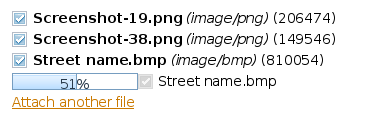
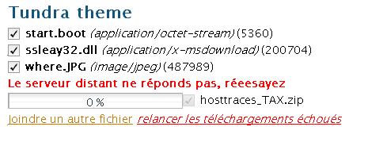

Screenshots
==================

Upload with progress bar indicator
====================================

.. note::
	:abbr:`MFU (Multiple File Uploader)` is mono-thread. Files with 0% progress are considered as pending. ( ça fait pas tres marketing, mais faudrait trouver un moyen d'expliquer pkoi ils sont à 0% )

Connection error
===========================
 
.. note::
	If an error occurs like a network error, a link allows you to restart failed files

	

possible errors
===========================

.. note::
	:abbr:`MFU (Multiple File Uploader)` interacts with the server using a REST/JSON-based protocol. In case the server does not respect the protocol correctly, it displays adequate errors that can be customized and :doc:internationalized 

.. image:: _static/sample3.png

:file:`conf.py`